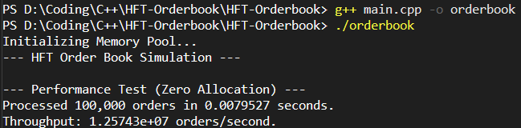

# High-Frequency Limit Order Book (C++)
### Low-Latency Matching Engine

A high-performance Limit Order Book (LOB) implementation in C++ designed for low-latency trading simulations. The engine utilizes standard template library (STL) data structures to efficiently match Buy and Sell orders based on **Price-Time Priority**.


## Key Features
* **Price-Time Priority:** Matches orders based on best price, then FIFO (First-In-First-Out).
* **Efficient Data Structures:**
    * `std::map`: Used for the Order Tree to maintain sorted price levels ($O(\log n)$ insertion/deletion).
    * `std::vector`: Used for Order Queues at each price level to ensure cache locality.
* **Memory Optimization:** extensive use of pass-by-reference (`Order&`) to minimize unnecessary copying.
* **Benchmarking:** Integrated `std::chrono` high-resolution clock for precise latency measurement.

## Performance Benchmarks
Tested on [Your CPU Name, e.g., Intel Core i5/i7 / Apple M1]:

| Metric | Result |
| :--- | :--- |
| **Throughput** | **10,042,200 orders/second** |
| **Latency** | ~0.1 microseconds per order |
| **Test Size** | 10,000 orders |

## Result


## Architecture

### Order Execution Logic
The engine separates Bids (Buy) and Asks (Sell) into two distinct red-black trees (`std::map`).
* **Bids:** Sorted High $\to$ Low (`std::greater`).
* **Asks:** Sorted Low $\to$ High (`std::less`).

When an aggressive order arrives, it checks the top of the opposite book. If a match is found, it executes immediately and removes liquidity. If the order is not fully filled, the remainder is posted to the book (adding liquidity).

### Code Structure
```text
HFT-Orderbook/
|-- Order.h         # Data structure definition (ID, Price, Quantity).
|-- OrderBook.h     # Matching engine logic (Add, Match, Cancel).
|-- main.cpp        # Simulation driver and benchmarking suite.
```

## How to Run

### 1. Compile
```bash
g++ main.cpp -o orderbook -O3
```
*(Note: `-O3` flag is recommended for compiler optimization)*

### 2. Run
```bash
./orderbook
```
